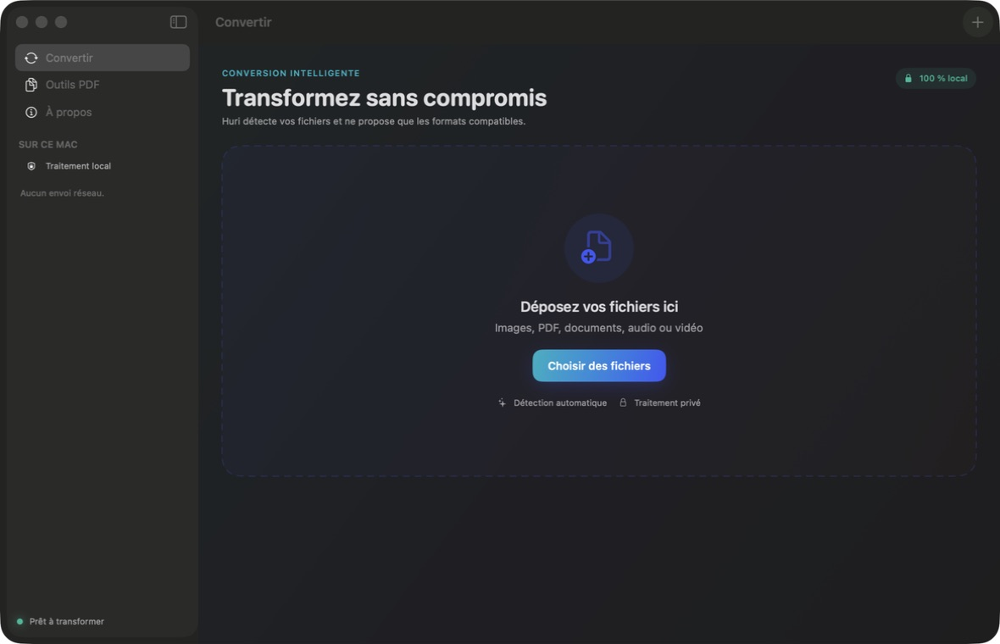

# Huri

> Vos fichiers, transformés.

Huri est une application macOS native de conversion et de manipulation de
fichiers. Elle travaille localement, sans compte, sans télémétrie et sans envoi
vers un serveur. Le code est libre sous licence MIT.

Huri est développé et publié par
[Pacific Knowledge](https://pacificknowledge.dev).

Site officiel : <https://huri-jet.vercel.app>



## Fonctionnalités

- Détection du contenu et proposition des seules conversions cohérentes.
- Catalogue de 305 formats distincts couvrant archives, audio, CAD, documents,
  livres numériques, polices, images, présentations, vecteurs et vidéos.
- Capacités vérifiées à l’exécution : une conversion n’est proposée que si son
  moteur local est réellement disponible.
- Images : PNG, JPEG, WebP, TIFF, HEIC, GIF et BMP.
- Images vers PDF et PDF multipage vers images.
- Détourage automatique avec Vision lors d’un export PNG.
- PDF : aperçu, fusion, réordre, rotation, suppression de pages et découpe.
- Texte/RTF vers PDF ou image.
- Audio : MP3, M4A, WAV et AIFF vers les formats compatibles.
- Vidéo : MOV, MP4 et M4V, avec extraction audio M4A.
- Import par glisser-déposer ou sélecteur macOS, traitement par lot et
  progression.
- Moteurs open source locaux facultatifs : FFmpeg, ImageMagick, LibreOffice,
  Pandoc, calibre, 7-Zip, FontForge et Inkscape.

### Moteurs locaux facultatifs

Le moteur natif couvre les conversions usuelles sans installation. Pour la
longue traîne de Convertio, Huri détecte automatiquement les outils installés
dans `PATH`, Homebrew et les emplacements d’applications macOS habituels :

```bash
brew install ffmpeg imagemagick pandoc sevenzip fontforge
brew install --cask libreoffice calibre inkscape
```

Ces outils restent entièrement locaux. Huri ne les télécharge pas, ne les
embarque pas et n’exécute jamais de shell : chaque processus reçoit une liste
d’arguments séparés. La disponibilité affichée dans l’écran **Formats** reflète
le Mac courant. Les formats source uniquement (par exemple de nombreux RAW) ne
sont jamais proposés comme sorties.

## Principes

- **Privé** : chaque octet reste sur le Mac.
- **Natif** : SwiftUI, AppKit, PDFKit, Image I/O, Vision et AVFoundation.
- **Léger** : le cœur distribué garde une seule dépendance de production,
  `libwebp`; les moteurs étendus restent facultatifs.
- **Prudent** : le fichier source n’est jamais modifié et les exports utilisent
  des noms uniques.
- **Honnête** : « format connu » et « conversion exécutable » sont deux états
  distincts ; une paire n’apparaît que si un moteur local sait la traiter.

## Prérequis

- macOS 14 ou version ultérieure.
- Xcode 16 ou version ultérieure (Xcode 26 et Swift 6.2 recommandés).
- LibreOffice facultatif pour DOC/DOCX.

## Développement

```bash
make build
make test
make run
```

Le projet est un package Swift afin de rester lisible et reproductible. Xcode
peut ouvrir directement `Package.swift`.

### Site vitrine

La landing page est volontairement statique : HTML, CSS et JavaScript natifs,
sans framework, backend, analytics ou ressource distante. Pour la prévisualiser :

```bash
python3 -m http.server 4173
```

L’installateur universel Apple Silicon + Intel référencé par le site est une
GitHub Release signée Developer ID, notarisée et agrafée par Apple. Sa création
exige les credentials de distribution :

```bash
make downloads
```

Cette commande échoue volontairement si `SIGNING_IDENTITY` ou les credentials
de notarisation ne sont pas configurés. Un build local ad hoc ne doit jamais
être servi comme téléchargement public.

La configuration de production se trouve dans `vercel.json`. Les étapes de
déploiement, validation et rollback sont détaillées dans
[docs/WEB_RELEASE.md](docs/WEB_RELEASE.md).

## Créer l’application

```bash
make package
open dist/Huri.app
```

Pour créer une image disque locale :

```bash
make dmg
```

Les artefacts locaux sont signés ad hoc. La pipeline de release sait produire
un DMG Developer ID signé et notarisé pour Homebrew ainsi qu’un paquet signé
pour App Store Connect lorsque les secrets Apple sont disponibles. Voir
[le guide de release](docs/RELEASE.md).

## Architecture

Le cœur métier ne dépend d’aucun framework d’interface. Les services natifs
implémentent les protocoles du cœur, puis l’application SwiftUI les orchestre.
Voir [ADR-001](docs/ADR-001.md), [ADR-002](docs/ADR-002.md), la
[matrice concurrentielle](docs/COMPETITOR_MATRIX.md) et le
[rapport QA](docs/QA.md).

## Confidentialité

Huri n’intègre ni backend, ni SDK analytique, ni publicités. L’accès réseau
pendant le build sert uniquement à résoudre les dépendances Swift. L’app
compilée n’effectue aucun appel réseau.

## Langues

L’interface suit automatiquement la langue de macOS. Le français et l’anglais
sont pris en charge, avec le français comme langue de repli. Le catalogue
`Localizable.xcstrings` est la source de vérité ; exécutez
`make localizations` après toute modification.

## Marque et contact

L’identité de Huri s’appuie sur le sens tahitien de « transformer ». Les règles
de marque sont documentées dans [docs/BRAND.md](docs/BRAND.md).

- Site : https://pacificknowledge.dev
- Produit : https://huri-jet.vercel.app
- Code source : https://github.com/Pacific-knowledge-LLC/Huri
- Contact : admin@pacificknowledge.dev

## Licence

Huri est un logiciel libre © 2026 Pacific Knowledge, publié sous
[licence MIT](LICENSE). Les dépendances et moteurs facultatifs sont documentés
dans [THIRD_PARTY_NOTICES.md](THIRD_PARTY_NOTICES.md).
