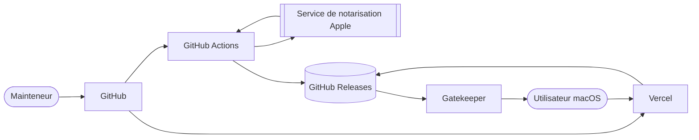

# Contexte de publication

Huri transforme des fichiers sur le Mac de l’utilisateur. Aucun fichier métier ne part vers un serveur. La distribution, elle, dépend de services externes : GitHub porte le code et les artefacts, Apple établit la confiance du binaire, Vercel sert le site.

## Responsabilité du système

Le système de publication doit livrer un DMG universel accepté par Gatekeeper. Il doit aussi maintenir un lien de téléchargement stable sur le site. Le [README du projet][readme] pose la règle : une compilation locale signée ad hoc ne devient jamais un téléchargement public.

## Acteurs

| Acteur | Responsabilité | Refus attendu |
|---|---|---|
| Mainteneur | Prépare la version, obtient une CI verte, crée le tag annoté | Ne publie pas depuis un poste non vérifié |
| GitHub Actions | Reconstruit, signe, notarise, vérifie et publie | Arrête le job si une preuve manque |
| Apple | Valide la signature et retourne un ticket de notarisation | Rejette un binaire non conforme |
| GitHub Releases | Conserve le DMG, les symboles et leurs sommes SHA-256 | Ne remplace pas silencieusement un artefact publié |
| Vercel | Sert le site statique et ses en-têtes HTTP | Ne devient pas un dépôt de binaires macOS |
| Gatekeeper | Évalue le DMG et l’application sur le Mac cible | Bloque une signature ou un ticket invalide |
| Proton Pass | Conserve les éléments de restauration chiffrés | N’expose aucune valeur dans le dépôt ou les journaux |

## Frontières

La page d’accueil reste statique. [La configuration Vercel][vercel] ne déclare ni API, ni fonction serveur, ni secret d’exécution. Ses boutons pointent vers l’artefact universel de la dernière publication GitHub.

L’application publiée reste locale. Les échanges avec Apple ont lieu pendant la publication, pas pendant une conversion utilisateur. [Le workflow nommé Release][workflow-release] limite les accès au runner de compilation.

Le canal Mac App Store reste optionnel. Une publication publique du site exige Developer ID et la notarisation. Elle n’exige ni paquet App Store, ni fiche commerciale publiée.

## Garanties

Une publication publique tient cinq promesses :

- un seul DMG contient `arm64` et `x86_64`
- l’application porte une signature Developer ID et le Hardened Runtime
- Apple accepte la notarisation et le ticket est agrafé au DMG
- Gatekeeper accepte le DMG et l’application montée
- le site télécharge exactement l’artefact et la somme publiés par GitHub Releases

[Le script de distribution][package-downloads] construit ces preuves. [Le script de vérification][verify-distribution] les exige avant publication.

## Sources de vérité

| Donnée | Source |
|---|---|
| Version applicative | [`VERSION`][version-file] |
| Contenu du paquet | [`Scripts/package-app.sh`][package-app] |
| Politique de publication | [`.github/workflows/release.yml`][workflow-release] |
| Contrôles CI | [`.github/workflows/ci.yml`][workflow-ci] |
| Artefact public | Publication GitHub créée par le workflow |
| Déploiement web | [`vercel.json`][vercel] et projet Vercel lié à `main` |
| Restauration des accès | Proton Pass, hors dépôt |

## Invariant de publication

Le lien public ne doit jamais précéder l’artefact valide. Une réponse HTTP en erreur, une somme absente, un ticket non agrafé ou un refus Gatekeeper bloque la promotion Vercel. Le dernier déploiement sain reste la cible du retour arrière.

[readme]: https://github.com/Pacific-knowledge-LLC/Huri/blob/main/README.md
[vercel]: https://github.com/Pacific-knowledge-LLC/Huri/blob/main/vercel.json
[workflow-release]: https://github.com/Pacific-knowledge-LLC/Huri/blob/main/.github/workflows/release.yml
[workflow-ci]: https://github.com/Pacific-knowledge-LLC/Huri/blob/main/.github/workflows/ci.yml
[package-downloads]: https://github.com/Pacific-knowledge-LLC/Huri/blob/main/Scripts/package-downloads.sh
[verify-distribution]: https://github.com/Pacific-knowledge-LLC/Huri/blob/main/Scripts/verify-distribution.sh
[package-app]: https://github.com/Pacific-knowledge-LLC/Huri/blob/main/Scripts/package-app.sh
[version-file]: https://github.com/Pacific-knowledge-LLC/Huri/blob/main/VERSION
