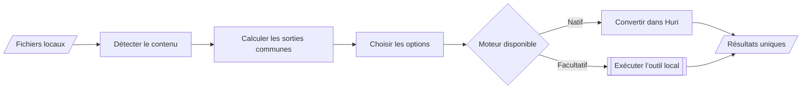

# Fonctionnalités

Huri sépare le catalogue de la capacité réelle. Le catalogue nomme les formats. Le registre autorise une paire seulement si un moteur local sait l’exécuter. Cette règle se trouve dans [`FileFormat.swift`](https://github.com/Pacific-knowledge-LLC/Huri/blob/main/Sources/HuriCore/FileFormat.swift) et [`CapabilityRegistry.swift`](https://github.com/Pacific-knowledge-LLC/Huri/blob/main/Sources/HuriCore/CapabilityRegistry.swift).

Le flux de conversion garde cette décision au centre.

## Navigation

L’application possède quatre destinations.

| Destination | Fonction | Ancrage |
|---|---|---|
| Convertir | Importe, configure et exécute un lot | [`ConversionWorkspaceView.swift`](https://github.com/Pacific-knowledge-LLC/Huri/blob/main/Sources/HuriApp/ConversionWorkspaceView.swift) |
| Formats | Recherche le catalogue et expose la disponibilité locale | [`FormatCatalogView.swift`](https://github.com/Pacific-knowledge-LLC/Huri/blob/main/Sources/HuriApp/FormatCatalogView.swift) |
| Outils PDF | Manipule les pages de plusieurs documents | [`PDFToolsView.swift`](https://github.com/Pacific-knowledge-LLC/Huri/blob/main/Sources/HuriApp/PDFToolsView.swift) |
| À propos | Affiche identité, version, contact et relance l’accueil | [`HuriRootView.swift`](https://github.com/Pacific-knowledge-LLC/Huri/blob/main/Sources/HuriApp/HuriRootView.swift) |

Le menu Fichier ajoute `⌘O` pour importer. Le menu Conversion ajoute `⌘↩` pour démarrer. Les commandes ciblent la vue active dans [`HuriApp.swift`](https://github.com/Pacific-knowledge-LLC/Huri/blob/main/Sources/HuriApp/HuriApp.swift).

## Import et inspection

L’import accepte plusieurs URL par sélecteur ou glisser-déposer. Il ignore les doublons déjà chargés. Chaque fichier produit un `FileAsset` avec format, taille, dimensions, nombre de pages ou durée selon sa famille. Le modèle orchestre ce travail dans [`ConversionViewModel.swift`](https://github.com/Pacific-knowledge-LLC/Huri/blob/main/Sources/HuriApp/ConversionViewModel.swift).

L’inspecteur lit d’abord les octets magiques. Il consulte ensuite le type système puis l’extension. Un conflit entre contenu et extension devient un avertissement. Les règles sont dans [`LocalFileInspector.swift`](https://github.com/Pacific-knowledge-LLC/Huri/blob/main/Sources/HuriInfrastructure/LocalFileInspector.swift).

Une miniature accompagne chaque entrée quand Quick Look sait la produire. L’échec d’un aperçu ne bloque pas l’import. Le service vit dans [`QuickLookPreviewService.swift`](https://github.com/Pacific-knowledge-LLC/Huri/blob/main/Sources/HuriInfrastructure/QuickLookPreviewService.swift).

## Catalogue et capacités

Le catalogue contient 305 identifiants uniques répartis entre archives, audio, CAD, documents, livres numériques, polices, images, présentations, vecteurs et vidéos. Chaque entrée porte un accès lecture seule, écriture seule ou lecture-écriture. La table brute et sa normalisation vivent dans [`FileFormat.swift`](https://github.com/Pacific-knowledge-LLC/Huri/blob/main/Sources/HuriCore/FileFormat.swift).

L’écran Formats fournit quatre mesures : formats catalogués, formats disponibles, moteurs détectés et envois réseau. Il filtre par texte et par famille. Il marque chaque format comme disponible ou dépendant d’un moteur. Le rendu vit dans [`FormatCatalogView.swift`](https://github.com/Pacific-knowledge-LLC/Huri/blob/main/Sources/HuriApp/FormatCatalogView.swift).

Le registre retire le format source, les sorties non inscriptibles et les paires incohérentes. Un lot hétérogène reçoit seulement l’intersection de ses sorties. Ces invariants sont testés dans [`HuriCoreTests.swift`](https://github.com/Pacific-knowledge-LLC/Huri/blob/main/Tests/HuriCoreTests/HuriCoreTests.swift).

## Conversions natives

Le cœur fonctionne sans outil facultatif.

| Entrée | Sorties natives | Implémentation |
|---|---|---|
| PNG, JPEG, WebP, TIFF, HEIC, GIF, BMP | Images prises en charge par Image I/O, WebP et PDF | [`ImageEngine.swift`](https://github.com/Pacific-knowledge-LLC/Huri/blob/main/Sources/HuriInfrastructure/ImageEngine.swift), [`PDFEngine.swift`](https://github.com/Pacific-knowledge-LLC/Huri/blob/main/Sources/HuriInfrastructure/PDFEngine.swift) |
| PDF | Une image par page | [`PDFEngine.swift`](https://github.com/Pacific-knowledge-LLC/Huri/blob/main/Sources/HuriInfrastructure/PDFEngine.swift) |
| TXT, Markdown, RTF | PDF ou images | [`TextDocumentEngine.swift`](https://github.com/Pacific-knowledge-LLC/Huri/blob/main/Sources/HuriInfrastructure/TextDocumentEngine.swift) |
| MP3, M4A, WAV, AIFF | M4A, WAV ou AIFF selon la paire | [`MediaConversionEngine.swift`](https://github.com/Pacific-knowledge-LLC/Huri/blob/main/Sources/HuriInfrastructure/MediaConversionEngine.swift) |
| MP4, MOV, M4V | MP4, MOV, M4V ou extraction M4A | [`MediaConversionEngine.swift`](https://github.com/Pacific-knowledge-LLC/Huri/blob/main/Sources/HuriInfrastructure/MediaConversionEngine.swift) |

Un lot d’images vers PDF produit un seul document multipage. L’ordre des entrées devient l’ordre des pages. Le cas spécial vit dans [`LocalConversionCoordinator.swift`](https://github.com/Pacific-knowledge-LLC/Huri/blob/main/Sources/HuriInfrastructure/LocalConversionCoordinator.swift) et son test dans [`HuriInfrastructureTests.swift`](https://github.com/Pacific-knowledge-LLC/Huri/blob/main/Tests/HuriInfrastructureTests/HuriInfrastructureTests.swift).

## Moteurs facultatifs

Huri cherche les exécutables dans le `PATH`, Homebrew et les emplacements macOS connus. Il ne télécharge aucun moteur. La détection et le routage vivent dans [`LocalToolchain.swift`](https://github.com/Pacific-knowledge-LLC/Huri/blob/main/Sources/HuriInfrastructure/LocalToolchain.swift).

| Moteur | Périmètre activé |
|---|---|
| FFmpeg | Audio, vidéo et extraction audio depuis une vidéo |
| ImageMagick | Images, vecteurs et PDF en sortie |
| LibreOffice | Documents, tableurs, présentations et PDF selon la famille source |
| Pandoc | Documents, texte et livres numériques |
| calibre | Sorties livre numérique |
| 7-Zip ou outils macOS | ZIP, TAR, TGZ, TBZ2 et TAR.XZ |
| FontForge | Conversions entre formats de police inscriptibles |
| Inkscape | Vecteurs vers vecteurs, images ou PDF |

Le registre borne chaque moteur à sa famille. LibreOffice ne transforme pas un document Word en tableur. FFmpeg ne produit pas d’image depuis un fichier audio. Ces frontières sont testées dans [`HuriCoreTests.swift`](https://github.com/Pacific-knowledge-LLC/Huri/blob/main/Tests/HuriCoreTests/HuriCoreTests.swift).

## Options de conversion

Les options apparaissent selon la sortie et les entrées. La vue ne montre pas un réglage sans effet. La décision vit dans [`ConversionViewModel.swift`](https://github.com/Pacific-knowledge-LLC/Huri/blob/main/Sources/HuriApp/ConversionViewModel.swift).

- Qualité de 35 % à 100 % pour les sorties avec perte
- Échelle de 50 %, 100 %, 200 % ou 400 % pour image et vidéo
- Résolution de 72, 144, 300 ou 600 PPP pour rasteriser PDF, document, présentation ou texte
- Conservation des métadonnées pour image, audio et vidéo
- Suppression d’arrière-plan pour une sortie PNG compatible
- Dossier de destination modifiable, avec Téléchargements par défaut

[`ConversionOptions`](https://github.com/Pacific-knowledge-LLC/Huri/blob/main/Sources/HuriCore/DomainModels.swift) borne la qualité, l’échelle et la résolution. [`BackgroundRemovalEngine.swift`](https://github.com/Pacific-knowledge-LLC/Huri/blob/main/Sources/HuriInfrastructure/BackgroundRemovalEngine.swift) utilise Vision pour générer un masque de premier plan puis écrit un PNG transparent.

## Traitement par lot

Le coordinateur valide chaque paire avant le premier export. Il exécute au plus deux fichiers en parallèle. Il restitue les résultats dans l’ordre des entrées, même si les tâches terminent dans un autre ordre. Ce flux vit dans [`LocalConversionCoordinator.swift`](https://github.com/Pacific-knowledge-LLC/Huri/blob/main/Sources/HuriInfrastructure/LocalConversionCoordinator.swift).

La vue affiche une progression par fichier. Elle permet l’annulation. Un succès peut révéler tous les artefacts dans le Finder. Un échec conserve son message et propose une nouvelle tentative. Ces états vivent dans [`ConversionViewModel.swift`](https://github.com/Pacific-knowledge-LLC/Huri/blob/main/Sources/HuriApp/ConversionViewModel.swift) et [`ConversionWorkspaceView.swift`](https://github.com/Pacific-knowledge-LLC/Huri/blob/main/Sources/HuriApp/ConversionWorkspaceView.swift).

## Outils PDF

L’atelier PDF travaille sur une liste de `PDFPageReference`. Chaque référence garde le document source, l’index d’origine et une rotation. Le modèle est défini dans [`PDFModels.swift`](https://github.com/Pacific-knowledge-LLC/Huri/blob/main/Sources/HuriCore/PDFModels.swift).

Fonctions exposées :

- Import de plusieurs PDF par sélecteur ou glisser-déposer
- Aperçu de la page active avec PDFKit
- Sélection simple ou multiple
- Rotation à gauche ou à droite
- Réordre par glisser-déposer ou déplacement d’un cran
- Suppression de la sélection
- Fusion et export de l’ordre visible
- Extraction des pages sélectionnées
- Découpe du document actif par page ou par plages
- Annulation d’une opération et révélation du résultat dans le Finder

La vue se trouve dans [`PDFToolsView.swift`](https://github.com/Pacific-knowledge-LLC/Huri/blob/main/Sources/HuriApp/PDFToolsView.swift). Les opérations asynchrones et la validation des plages se trouvent dans [`PDFToolsViewModel.swift`](https://github.com/Pacific-knowledge-LLC/Huri/blob/main/Sources/HuriApp/PDFToolsViewModel.swift). Le moteur PDFKit se trouve dans [`PDFEngine.swift`](https://github.com/Pacific-knowledge-LLC/Huri/blob/main/Sources/HuriInfrastructure/PDFEngine.swift).

## Protection des fichiers

Une source n’est jamais une destination. Si un nom existe déjà, Huri ajoute un suffixe. Les écritures natives passent par un fichier temporaire puis un déplacement final. Ces règles vivent dans [`InfrastructureSupport.swift`](https://github.com/Pacific-knowledge-LLC/Huri/blob/main/Sources/HuriInfrastructure/InfrastructureSupport.swift) et [`LocalConversionCoordinator.swift`](https://github.com/Pacific-knowledge-LLC/Huri/blob/main/Sources/HuriInfrastructure/LocalConversionCoordinator.swift).

La conversion d’archives bloque les chemins absolus, les traversées de répertoire, les liens et les archives dépassant 50 000 entrées. Les contrôles précèdent l’extraction dans [`LocalToolchain.swift`](https://github.com/Pacific-knowledge-LLC/Huri/blob/main/Sources/HuriInfrastructure/LocalToolchain.swift). Les tests couvrent le refus des liens dans [`HuriInfrastructureTests.swift`](https://github.com/Pacific-knowledge-LLC/Huri/blob/main/Tests/HuriInfrastructureTests/HuriInfrastructureTests.swift).

## Langues et accessibilité

L’interface charge le français et l’anglais. Au premier lancement, [`HuriLanguage.swift`](https://github.com/Pacific-knowledge-LLC/Huri/blob/main/Sources/HuriCore/HuriLanguage.swift) choisit le français pour un macOS en français et l’anglais dans les autres cas. Le sélecteur de la barre latérale et le menu Langue changent l’interface sans redémarrage. `@AppStorage` conserve ce choix pour les sessions suivantes dans [`HuriRootView.swift`](https://github.com/Pacific-knowledge-LLC/Huri/blob/main/Sources/HuriApp/HuriRootView.swift) et [`HuriApp.swift`](https://github.com/Pacific-knowledge-LLC/Huri/blob/main/Sources/HuriApp/HuriApp.swift).

Les chaînes sont centralisées dans [`HuriL10n.swift`](https://github.com/Pacific-knowledge-LLC/Huri/blob/main/Sources/HuriCore/HuriL10n.swift) et [`Localizable.xcstrings`](https://github.com/Pacific-knowledge-LLC/Huri/blob/main/Sources/HuriCore/Resources/Localizable.xcstrings). Une locale explicitement demandée mais non prise en charge retombe sur le français. La détection initiale d’un système dans une troisième langue choisit l’anglais.

Les zones de dépôt, cartes de format, pages PDF et commandes portent des libellés d’accessibilité. Les animations d’accueil respectent la réduction des mouvements. Les implémentations se trouvent dans [`ConversionWorkspaceView.swift`](https://github.com/Pacific-knowledge-LLC/Huri/blob/main/Sources/HuriApp/ConversionWorkspaceView.swift), [`FormatCatalogView.swift`](https://github.com/Pacific-knowledge-LLC/Huri/blob/main/Sources/HuriApp/FormatCatalogView.swift), [`PDFToolsView.swift`](https://github.com/Pacific-knowledge-LLC/Huri/blob/main/Sources/HuriApp/PDFToolsView.swift) et [`OnboardingView.swift`](https://github.com/Pacific-knowledge-LLC/Huri/blob/main/Sources/HuriApp/OnboardingView.swift).

## Hors périmètre

Le code audité n’expose ni API serveur, ni compte, ni synchronisation cloud, ni historique persistant des conversions. Il n’installe pas les moteurs facultatifs. Il n’active pas une conversion à partir du seul nom de format. Les services réellement assemblés sont listés dans [`HuriInfrastructure.swift`](https://github.com/Pacific-knowledge-LLC/Huri/blob/main/Sources/HuriInfrastructure/HuriInfrastructure.swift).
