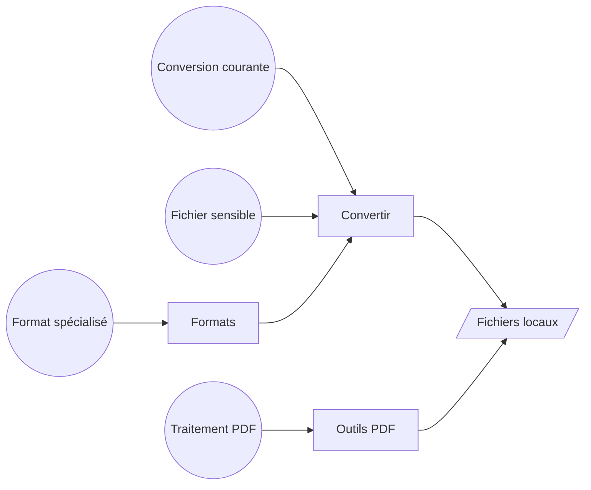

# Personas

Huri ne connaît ni compte ni rôle métier. Il expose quatre espaces : convertir, formats, outils PDF et à propos. Les profils ci-dessous viennent de ces parcours, pas d’une segmentation marketing. Le routage vit dans [`HuriRootView.swift`](https://github.com/Pacific-knowledge-LLC/Huri/blob/main/Sources/HuriApp/HuriRootView.swift).

Chaque profil rejoint la surface qui sert son travail.

## Conversion courante

Ce profil veut changer le format d’un ou plusieurs fichiers. Il importe par le sélecteur macOS ou par glisser-déposer. Il choisit ensuite une sortie commune à tout le lot. Ce parcours est implémenté dans [`ConversionWorkspaceView.swift`](https://github.com/Pacific-knowledge-LLC/Huri/blob/main/Sources/HuriApp/ConversionWorkspaceView.swift) et [`ConversionViewModel.swift`](https://github.com/Pacific-knowledge-LLC/Huri/blob/main/Sources/HuriApp/ConversionViewModel.swift).

### Objectifs

- Importer plusieurs fichiers sans créer de doublon
- Voir le type, la taille et l’aperçu de chaque entrée
- Choisir une sortie compatible avec tout le lot
- Régler la qualité, l’échelle, les métadonnées ou la résolution quand le format le permet
- Suivre, annuler puis révéler les résultats dans le Finder

### Contraintes observables

La destination initiale est le dossier Téléchargements. Une conversion ne démarre pas sans entrée, sortie et destination valides. Le modèle calcule l’intersection des sorties du lot avant d’activer l’action. Ces règles vivent dans [`ConversionViewModel.swift`](https://github.com/Pacific-knowledge-LLC/Huri/blob/main/Sources/HuriApp/ConversionViewModel.swift) et [`CapabilityRegistry.swift`](https://github.com/Pacific-knowledge-LLC/Huri/blob/main/Sources/HuriCore/CapabilityRegistry.swift).

## Opérateur PDF

Ce profil travaille sur des pages, pas sur des formats abstraits. Il importe plusieurs PDF. Il réordonne, tourne, supprime, extrait ou assemble leurs pages. Le parcours est défini dans [`PDFToolsView.swift`](https://github.com/Pacific-knowledge-LLC/Huri/blob/main/Sources/HuriApp/PDFToolsView.swift) et [`PDFToolsViewModel.swift`](https://github.com/Pacific-knowledge-LLC/Huri/blob/main/Sources/HuriApp/PDFToolsViewModel.swift).

### Objectifs

- Prévisualiser la page sélectionnée
- Réordonner les pages par déplacement ou par commandes haut et bas
- Appliquer une rotation à la sélection
- Supprimer ou extraire une sélection
- Fusionner toutes les pages dans leur ordre visible
- Découper un document page par page ou par plages

### Contraintes observables

Le sélecteur de fichiers accepte uniquement les PDF. Les plages utilisent une notation telle que `1-3, 5, 8-10`. Le moteur refuse les plages vides ou hors limites. La validation est partagée entre [`PDFToolsViewModel.swift`](https://github.com/Pacific-knowledge-LLC/Huri/blob/main/Sources/HuriApp/PDFToolsViewModel.swift) et [`PDFEngine.swift`](https://github.com/Pacific-knowledge-LLC/Huri/blob/main/Sources/HuriInfrastructure/PDFEngine.swift).

## Utilisateur de formats spécialisés

Ce profil possède déjà des outils locaux. Il cherche une conversion de média, document, livre numérique, archive, police ou vecteur. Huri détecte FFmpeg, ImageMagick, LibreOffice, Pandoc, calibre, 7-Zip, FontForge et Inkscape. La détection vit dans [`LocalToolchain.swift`](https://github.com/Pacific-knowledge-LLC/Huri/blob/main/Sources/HuriInfrastructure/LocalToolchain.swift).

### Objectifs

- Rechercher un format par nom ou par famille
- Distinguer entrée, sortie et lecture seule
- Voir les moteurs disponibles sur le Mac courant
- Lancer uniquement une paire qu’un moteur installé sait exécuter

### Contraintes observables

Le catalogue décrit 305 formats uniques. Il ne promet pas 305 conversions actives. [`FormatCatalogView.swift`](https://github.com/Pacific-knowledge-LLC/Huri/blob/main/Sources/HuriApp/FormatCatalogView.swift) affiche séparément le catalogue, les formats disponibles et les moteurs détectés. [`CapabilityRegistry.swift`](https://github.com/Pacific-knowledge-LLC/Huri/blob/main/Sources/HuriCore/CapabilityRegistry.swift) reste la source de vérité des paires exécutables.

## Utilisateur de fichiers sensibles

Ce profil refuse l’envoi de ses fichiers vers un serveur. L’inspecteur rejette toute URL qui n’est pas un fichier local. Les services sont assemblés dans le processus de l’application. Ces limites sont explicites dans [`LocalFileInspector.swift`](https://github.com/Pacific-knowledge-LLC/Huri/blob/main/Sources/HuriInfrastructure/LocalFileInspector.swift) et [`HuriInfrastructure.swift`](https://github.com/Pacific-knowledge-LLC/Huri/blob/main/Sources/HuriInfrastructure/HuriInfrastructure.swift).

### Objectifs

- Lire et convertir sans compte
- Garder les sources intactes
- Éviter l’écrasement d’un résultat existant
- Exécuter les moteurs facultatifs depuis le Mac local

### Garanties ancrées dans le code

Le coordinateur crée des destinations uniques et travaille dans un dossier temporaire par conversion. Le test `testConversionNeverOverwritesTheSource` vérifie l’intégrité de la source dans [`HuriInfrastructureTests.swift`](https://github.com/Pacific-knowledge-LLC/Huri/blob/main/Tests/HuriInfrastructureTests/HuriInfrastructureTests.swift). Les archives passent aussi par un contrôle des chemins, des liens et du nombre d’entrées dans [`LocalToolchain.swift`](https://github.com/Pacific-knowledge-LLC/Huri/blob/main/Sources/HuriInfrastructure/LocalToolchain.swift).

## Premier lancement

Le débutant traverse trois écrans : conversion, PDF et confidentialité. Il peut ignorer ce parcours. Il peut aussi relancer la visite depuis l’écran à propos. L’état de complétion est local et versionné dans [`OnboardingView.swift`](https://github.com/Pacific-knowledge-LLC/Huri/blob/main/Sources/HuriApp/OnboardingView.swift) et [`HuriRootView.swift`](https://github.com/Pacific-knowledge-LLC/Huri/blob/main/Sources/HuriApp/HuriRootView.swift).

## Limites des personas

Le code ne définit ni administrateur, ni organisation, ni partage, ni historique utilisateur. N’en invente pas. Toute évolution vers ces rôles demanderait de nouveaux modèles métier, absents de [`DomainModels.swift`](https://github.com/Pacific-knowledge-LLC/Huri/blob/main/Sources/HuriCore/DomainModels.swift).
