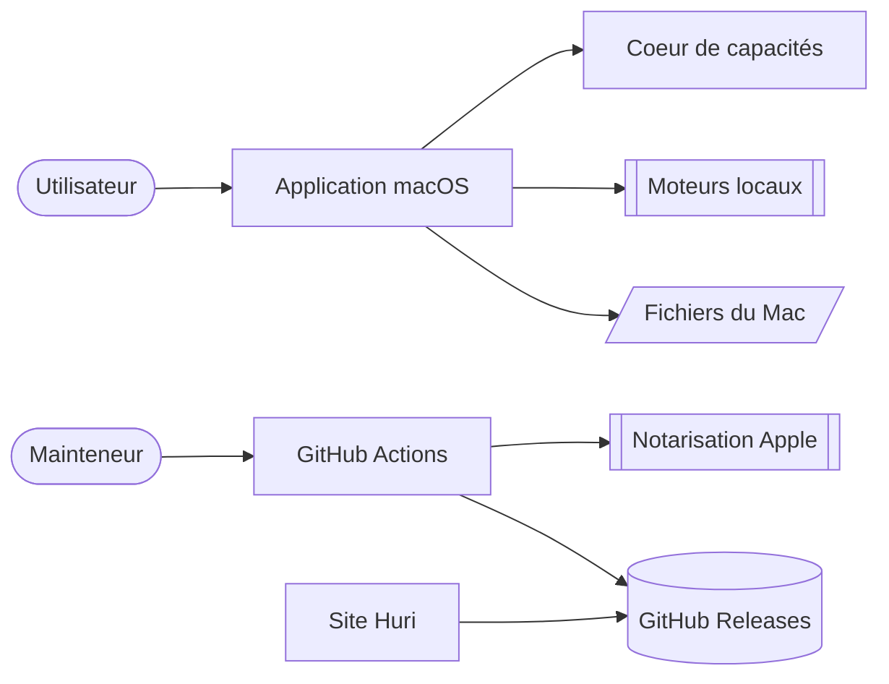

# Huri

Huri transforme des fichiers sur macOS sans les envoyer vers un serveur. Le cœur décide quelles conversions sont cohérentes. Les moteurs locaux les exécutent. La chaîne de publication signe, notarise et vérifie chaque binaire avant de l’exposer sur le site.

## Fonctionnel

- [Contexte](./functional/context.md) — frontières, acteurs et garanties
- [Personas](./functional/personas.md) — profils déduits des parcours réels
- [Fonctionnalités](./functional/features.md) — conversions, PDF, formats et protection des fichiers

## Technique

- [Architecture](./technical/architecture.md) — modules, dépendances et moteurs
- [Données](./technical/data.md) — modèles en mémoire, fichiers et persistance locale
- [Patterns](./technical/patterns.md) — conventions, erreurs, injection et tests

## Exploitation

- [Release](./technical/release.md) — version, tag, signature, notarisation et publication
- [Secrets](./technical/secrets.md) — sources, injection, Proton Pass et rotation
- [Validation](./technical/validation.md) — quality gates, Gatekeeper, production et retour arrière

## Hors périmètre

Cette documentation ne génère pas de référence API. Le projet n’expose aucune API serveur. Une future API devra publier sa propre référence avec un générateur dédié.
