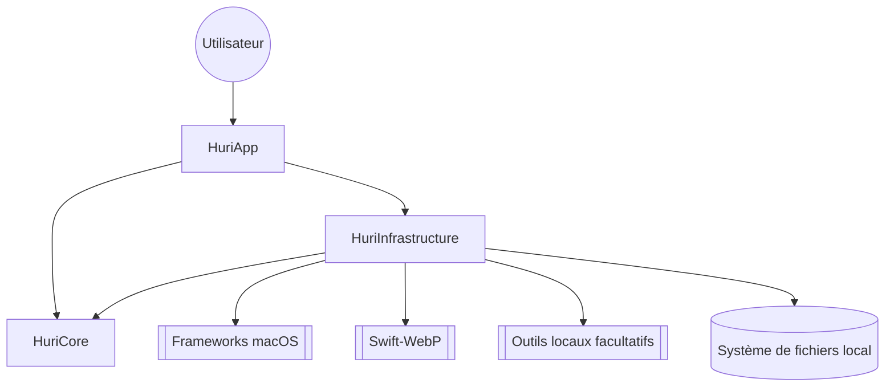
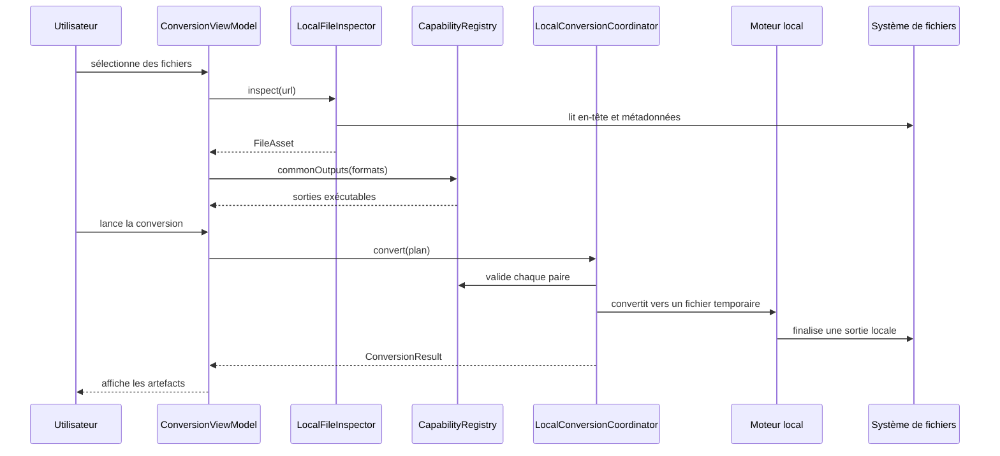

# Architecture

Huri est une application macOS native. Trois modules Swift composent le produit. Aucun serveur applicatif, aucune API distante et aucune base de données ne participent aux conversions.

## Carte du système

Les dépendances pointent vers le cœur. Le manifeste Swift impose cette règle dans [`Package.swift`](https://github.com/Pacific-knowledge-LLC/Huri/blob/main/Package.swift#L5-L65).

| Module | Responsabilité | Dépendances autorisées |
|---|---|---|
| `HuriCore` | Modèles, formats, capacités, erreurs et protocoles | `Foundation` |
| `HuriInfrastructure` | Inspection, conversion, PDF, aperçus et outils locaux | `HuriCore`, frameworks macOS, `Swift-WebP` |
| `HuriApp` | Vues SwiftUI, états d’écran et commandes macOS | `HuriCore`, `HuriInfrastructure` |

Le cœur ne connaît ni SwiftUI ni les moteurs concrets. Lis [`Protocols.swift`](https://github.com/Pacific-knowledge-LLC/Huri/blob/main/Sources/HuriCore/Protocols.swift#L1-L22) avant d’ajouter une dépendance. Une dépendance vers l’extérieur dans `HuriCore` briserait la frontière.

## Point de composition

[`HuriRootView`](https://github.com/Pacific-knowledge-LLC/Huri/blob/main/Sources/HuriApp/HuriRootView.swift#L33-L56) crée une instance de [`HuriServices`](https://github.com/Pacific-knowledge-LLC/Huri/blob/main/Sources/HuriInfrastructure/HuriInfrastructure.swift#L12-L49). Cette structure assemble l’inspecteur, le registre, le coordinateur, le moteur PDF, l’aperçu et la chaîne d’outils. Les deux modèles de vue partagent ce graphe de services.

La disponibilité est calculée au démarrage. [`LocalToolchain`](https://github.com/Pacific-knowledge-LLC/Huri/blob/main/Sources/HuriInfrastructure/LocalToolchain.swift#L4-L80) cherche les exécutables connus dans `PATH`, Homebrew et les applications macOS. Il ne télécharge rien.

## Flux de conversion

Une conversion suit un seul sens. La source reste hors du chemin d’écriture.

[`ConversionViewModel.importFiles(_:)`](https://github.com/Pacific-knowledge-LLC/Huri/blob/main/Sources/HuriApp/ConversionViewModel.swift#L131-L193) inspecte les entrées en parallèle. [`CapabilityRegistry.commonOutputs(for:context:)`](https://github.com/Pacific-knowledge-LLC/Huri/blob/main/Sources/HuriCore/CapabilityRegistry.swift#L109-L118) calcule l’intersection des sorties. [`LocalConversionCoordinator.convert(plan:progress:)`](https://github.com/Pacific-knowledge-LLC/Huri/blob/main/Sources/HuriInfrastructure/LocalConversionCoordinator.swift#L41-L215) valide ensuite le plan et borne les conversions simultanées à deux.

## Moteurs et adaptateurs

Le chemin natif couvre les formats usuels. `ImageEngine`, `PDFEngine`, `MediaConversionEngine`, `TextDocumentEngine` et `BackgroundRemovalEngine` encapsulent les frameworks Apple. La dépendance `Swift-WebP` garantit l’encodage et le décodage WebP.

La longue traîne passe par des adaptateurs locaux. [`LocalToolchainConversionEngine`](https://github.com/Pacific-knowledge-LLC/Huri/blob/main/Sources/HuriInfrastructure/LocalToolchain.swift#L83-L238) route vers FFmpeg, ImageMagick, LibreOffice, Pandoc, calibre, 7-Zip, FontForge ou Inkscape. [`ProcessRunner.run`](https://github.com/Pacific-knowledge-LLC/Huri/blob/main/Sources/HuriInfrastructure/LocalToolchain.swift#L727-L802) fournit une URL d’exécutable et un tableau d’arguments à `Process`. Aucun shell n’interprète les noms de fichiers.

## Frontières de confiance

Le fichier choisi par l’utilisateur est une entrée non fiable. [`LocalFileInspector`](https://github.com/Pacific-knowledge-LLC/Huri/blob/main/Sources/HuriInfrastructure/LocalFileInspector.swift#L10-L67) exige une URL locale et lisible, puis privilégie les octets magiques sur l’extension. Le registre refuse toute paire que le Mac courant ne sait pas exécuter.

Les archives reçoivent une frontière supplémentaire. [`preflightArchive`](https://github.com/Pacific-knowledge-LLC/Huri/blob/main/Sources/HuriInfrastructure/LocalToolchain.swift#L541-L611) limite le nombre d’entrées et rejette les liens. [`validateExtractedArchive`](https://github.com/Pacific-knowledge-LLC/Huri/blob/main/Sources/HuriInfrastructure/LocalToolchain.swift#L631-L659) interdit les sorties hors racine et borne le volume extrait à 20 Go.

## Concurrence

Les états d’interface restent sur `@MainActor` dans [`ConversionViewModel`](https://github.com/Pacific-knowledge-LLC/Huri/blob/main/Sources/HuriApp/ConversionViewModel.swift#L25-L302) et [`PDFToolsViewModel`](https://github.com/Pacific-knowledge-LLC/Huri/blob/main/Sources/HuriApp/PDFToolsViewModel.swift#L19-L285). Les opérations mutables longues vivent dans des acteurs : [`LocalConversionCoordinator`](https://github.com/Pacific-knowledge-LLC/Huri/blob/main/Sources/HuriInfrastructure/LocalConversionCoordinator.swift#L4-L39), [`PDFEngine`](https://github.com/Pacific-knowledge-LLC/Huri/blob/main/Sources/HuriInfrastructure/PDFEngine.swift#L6-L11) et [`BackgroundRemovalEngine`](https://github.com/Pacific-knowledge-LLC/Huri/blob/main/Sources/HuriInfrastructure/BackgroundRemovalEngine.swift#L11-L18).

L’annulation traverse les tâches Swift jusqu’aux processus locaux. [`CancellableProcessBox`](https://github.com/Pacific-knowledge-LLC/Huri/blob/main/Sources/HuriInfrastructure/LocalToolchain.swift#L804-L831) termine le processus actif quand la tâche est annulée.

## Hors du système

Il n’existe ni service HTTP, ni stockage cloud, ni télémétrie, ni compte utilisateur. La recherche de `URLSession`, Core Data, SwiftData et SQLite ne trouve aucune implémentation applicative. Les liens du menu Aide ouvrent le site ou le client de messagerie sur action explicite ; ils ne font pas partie du flux de conversion dans [`HuriApp.swift`](https://github.com/Pacific-knowledge-LLC/Huri/blob/main/Sources/HuriApp/HuriApp.swift#L49-L79).

Le site vitrine et la chaîne de publication restent hors du binaire. Les scripts sous [`Scripts/`](https://github.com/Pacific-knowledge-LLC/Huri/tree/main/Scripts) construisent, signent et vérifient l’application. Ils ne servent aucune conversion à l’exécution.
