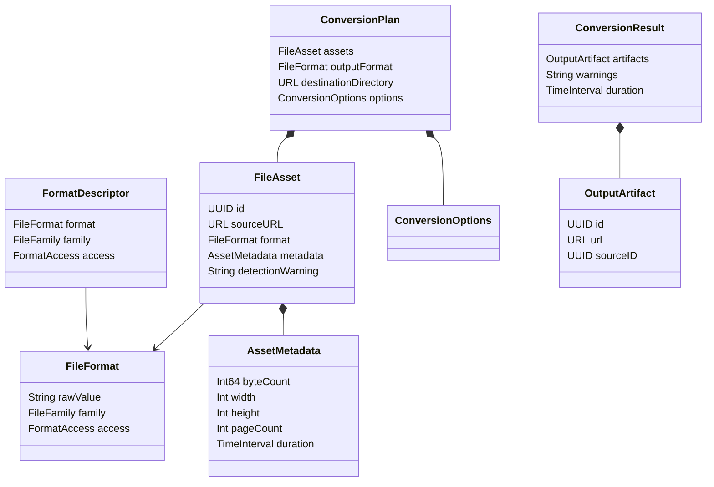
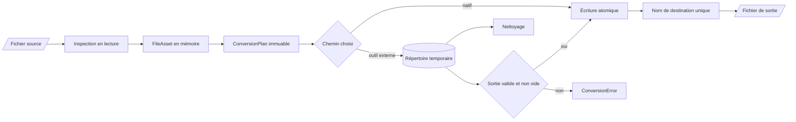

# Données

Huri ne possède aucun schéma de base de données. Les données ont quatre durées de vie : catalogue embarqué, état en mémoire, fichiers locaux et préférence d’accueil. Il n’existe aucune migration de données métier.

## Modèle métier

Les types du cœur sont des valeurs `Sendable`. Ils circulent entre l’interface et les moteurs sans dépendre d’un framework de présentation.

[`DomainModels.swift`](https://github.com/Pacific-knowledge-LLC/Huri/blob/main/Sources/HuriCore/DomainModels.swift#L3-L153) définit le contrat de conversion. `FileAsset` référence la source. `ConversionPlan` fige les entrées, la cible, le répertoire et les options. `ConversionResult` ne garde que les URL produites, les avertissements et la durée.

[`FileFormat.swift`](https://github.com/Pacific-knowledge-LLC/Huri/blob/main/Sources/HuriCore/FileFormat.swift#L3-L232) porte l’identité, la famille et les droits de lecture ou d’écriture. `FileFormat` est une structure ouverte, pas une énumération fermée. Un moteur local peut donc étendre les capacités sans changer le modèle persistant, puisqu’il n’en existe pas.

## Catalogue embarqué

[`FormatCatalog.entries`](https://github.com/Pacific-knowledge-LLC/Huri/blob/main/Sources/HuriCore/FileFormat.swift#L235-L275) transforme une matrice texte compilée dans le binaire en descripteurs uniques. Le catalogue décrit ce qui existe. Il ne promet pas ce qui est exécutable.

[`CapabilityContext`](https://github.com/Pacific-knowledge-LLC/Huri/blob/main/Sources/HuriCore/CapabilityRegistry.swift#L29-L46) capture les moteurs réellement présents sur le Mac. [`CapabilityRegistry`](https://github.com/Pacific-knowledge-LLC/Huri/blob/main/Sources/HuriCore/CapabilityRegistry.swift#L48-L138) combine catalogue, droits d’accès et contexte. Cette séparation empêche un format catalogué mais indisponible d’apparaître comme conversion valide.

Les traductions sont aussi embarquées. [`HuriL10n.swift`](https://github.com/Pacific-knowledge-LLC/Huri/blob/main/Sources/HuriCore/HuriL10n.swift#L3-L79) lit les ressources françaises et anglaises depuis `Huri_HuriCore.bundle`. Aucune traduction n’est chargée depuis le réseau.

## État en mémoire

[`ConversionViewModel`](https://github.com/Pacific-knowledge-LLC/Huri/blob/main/Sources/HuriApp/ConversionViewModel.swift#L25-L302) conserve le lot importé, la sortie choisie, les options, la destination et l’état courant. Cet état disparaît à la fermeture de l’application. Huri ne mémorise ni historique de conversion ni index de fichiers.

[`PDFToolsViewModel`](https://github.com/Pacific-knowledge-LLC/Huri/blob/main/Sources/HuriApp/PDFToolsViewModel.swift#L19-L285) conserve les références de pages, leur ordre, leur rotation et la sélection. [`PDFPageReference`](https://github.com/Pacific-knowledge-LLC/Huri/blob/main/Sources/HuriCore/PDFModels.swift#L3-L32) ne copie pas le contenu PDF en mémoire métier ; il pointe vers une URL et un index de page.

## Détection des fichiers

L’inspection produit un `FileAsset`. Elle ne modifie pas la source.

1. [`readHeader(at:)`](https://github.com/Pacific-knowledge-LLC/Huri/blob/main/Sources/HuriInfrastructure/LocalFileInspector.swift#L145-L158) lit au plus 64 octets
2. [`formatFromMagicBytes(_:)`](https://github.com/Pacific-knowledge-LLC/Huri/blob/main/Sources/HuriInfrastructure/LocalFileInspector.swift#L69-L122) reconnaît les signatures connues
3. `UTType` complète la détection
4. L’extension sert de dernier repli
5. Une contradiction entre contenu et extension devient un avertissement

Les métadonnées restent minimales. Taille, dimensions, nombre de pages et durée suffisent à l’interface. [`metadata(for:format:byteCount:)`](https://github.com/Pacific-knowledge-LLC/Huri/blob/main/Sources/HuriInfrastructure/LocalFileInspector.swift#L201-L255) délègue à Image I/O, PDFKit ou AVFoundation selon la famille.

## Cycle de vie des fichiers

La source reste immuable. Le chemin natif écrit atomiquement. Le chemin externe valide un fichier temporaire avant le déplacement final.

[`InfrastructureSupport.writeAtomically(_:to:)`](https://github.com/Pacific-knowledge-LLC/Huri/blob/main/Sources/HuriInfrastructure/InfrastructureSupport.swift#L13-L25) écrit les données atomiquement. [`uniqueDestination(in:basename:extension:)`](https://github.com/Pacific-knowledge-LLC/Huri/blob/main/Sources/HuriInfrastructure/InfrastructureSupport.swift#L27-L46) ajoute un suffixe au lieu d’écraser un fichier existant.

Les outils externes écrivent d’abord dans un fichier `.huri-<UUID>`. [`finalize(temporary:destination:)`](https://github.com/Pacific-knowledge-LLC/Huri/blob/main/Sources/HuriInfrastructure/LocalToolchain.swift#L668-L695) exige une sortie non vide avant le déplacement final. Le coordinateur supprime son répertoire temporaire avec `defer` dans [`LocalConversionCoordinator.swift`](https://github.com/Pacific-knowledge-LLC/Huri/blob/main/Sources/HuriInfrastructure/LocalConversionCoordinator.swift#L81-L92).

## Données PDF

[`PDFEditorPlan`](https://github.com/Pacific-knowledge-LLC/Huri/blob/main/Sources/HuriCore/PDFModels.swift#L27-L32) contient une liste ordonnée de références de pages. [`PDFEngine.export(plan:to:)`](https://github.com/Pacific-knowledge-LLC/Huri/blob/main/Sources/HuriInfrastructure/PDFEngine.swift#L31-L72) recharge chaque document source, copie les pages demandées, applique la rotation et génère un nouveau PDF.

La fusion, la sélection et le découpage créent de nouveaux fichiers. Aucun appel n’altère le PDF d’origine. Le test [`testConversionNeverOverwritesTheSource`](https://github.com/Pacific-knowledge-LLC/Huri/blob/main/Tests/HuriInfrastructureTests/HuriInfrastructureTests.swift#L121-L140) verrouille cette règle pour le pipeline général.

## Persistance locale

Deux préférences survivent au redémarrage. [`HuriRootView`](https://github.com/Pacific-knowledge-LLC/Huri/blob/main/Sources/HuriApp/HuriRootView.swift) les stocke avec `@AppStorage`. [`HuriOnboarding`](https://github.com/Pacific-knowledge-LLC/Huri/blob/main/Sources/HuriApp/OnboardingView.swift) déclare la version d’accueil terminée. [`HuriLanguage`](https://github.com/Pacific-knowledge-LLC/Huri/blob/main/Sources/HuriCore/HuriLanguage.swift) déclare la langue choisie et installe la préférence macOS au premier lancement.

| Donnée | Stockage | Durée | Sortie réseau |
|---|---|---|---|
| Catalogue et traductions | Ressources du binaire | Version de l’application | Aucune |
| Fichiers importés | URL et métadonnées en mémoire | Session | Aucune |
| Prévisualisations | `NSImage` en mémoire | Session | Aucune |
| Fichiers temporaires | Répertoire temporaire macOS | Durée d’une opération | Aucune |
| Résultats | Répertoire choisi par l’utilisateur | Jusqu’à suppression par l’utilisateur | Aucune |
| Accueil terminé | `UserDefaults` via `@AppStorage` | Entre les sessions | Aucune |
| Langue de l’interface | `UserDefaults` via `@AppStorage` | Entre les sessions | Aucune |

Il n’existe ni compte, ni jeton utilisateur, ni table, ni cache distant. Une évolution qui introduit un stockage persistant doit définir son schéma, sa migration, sa rétention et sa suppression. Ce chantier n’existe pas aujourd’hui.
