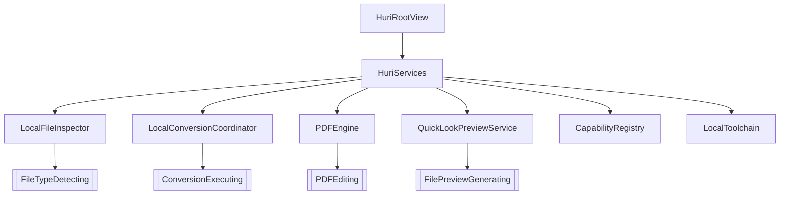
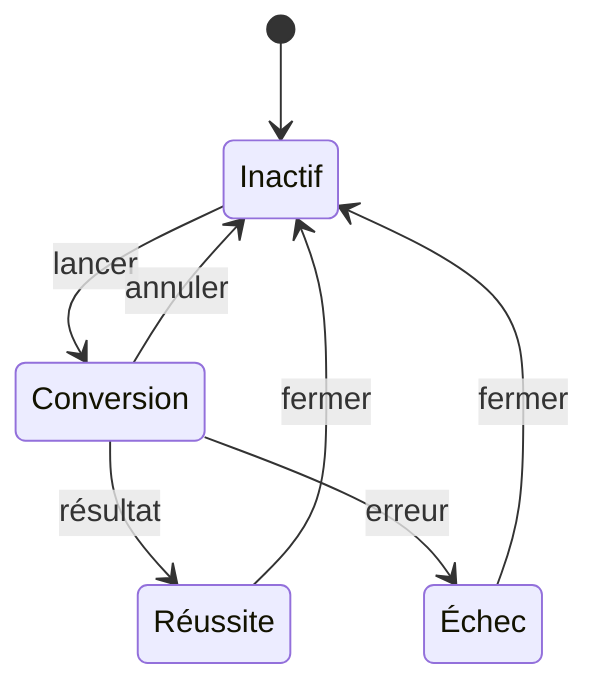

# Patrons et conventions

Les patrons servent les frontières. Ils ne décorent pas le code. Toute nouvelle conversion doit préserver le sens des dépendances, l’immuabilité des sources et l’exécution locale.

## Assemblage explicite

[`HuriServices.init()`](https://github.com/Pacific-knowledge-LLC/Huri/blob/main/Sources/HuriInfrastructure/HuriInfrastructure.swift#L24-L49) est le point de composition. Il construit les moteurs une fois, détecte les outils disponibles et injecte le même contexte de capacités dans l’application. Pas de conteneur global. Pas de singleton métier.

Les protocoles vivent dans [`HuriCore/Protocols.swift`](https://github.com/Pacific-knowledge-LLC/Huri/blob/main/Sources/HuriCore/Protocols.swift#L3-L22). Les implémentations vivent dans `HuriInfrastructure`. Le coordinateur accepte aussi un `BackgroundRemoving`, ce qui permet au test d’injecter [`RecordingBackgroundRemover`](https://github.com/Pacific-knowledge-LLC/Huri/blob/main/Tests/HuriInfrastructureTests/HuriInfrastructureTests.swift#L537-L548) sans Vision.

## Registre avant exécution

Le registre décide avant le moteur. [`CapabilityRegistry.outputs(for:context:)`](https://github.com/Pacific-knowledge-LLC/Huri/blob/main/Sources/HuriCore/CapabilityRegistry.swift#L51-L107) combine famille, droits d’écriture et moteurs disponibles. Le coordinateur répète la validation pour chaque entrée dans [`LocalConversionCoordinator.convert(plan:progress:)`](https://github.com/Pacific-knowledge-LLC/Huri/blob/main/Sources/HuriInfrastructure/LocalConversionCoordinator.swift#L41-L79).

Cette double barrière est volontaire. L’interface ne propose pas une paire impossible. Le moteur refuse quand même un plan construit hors interface ou devenu invalide.

## Catalogue piloté par les données

[`FileFormat`](https://github.com/Pacific-knowledge-LLC/Huri/blob/main/Sources/HuriCore/FileFormat.swift#L65-L232) est une valeur normalisée. [`FormatCatalog`](https://github.com/Pacific-knowledge-LLC/Huri/blob/main/Sources/HuriCore/FileFormat.swift#L235-L306) transforme la matrice embarquée en descripteurs. Ajouter un identifiant ne force pas une migration d’énumération.

Les droits `readOnly`, `writeOnly` et `readWrite` restent attachés au descripteur. Un format en lecture seule ne devient jamais une cible par commodité. [`testCompetitorCatalogIncludesEveryPublishedFamilyAndAccessRule`](https://github.com/Pacific-knowledge-LLC/Huri/blob/main/Tests/HuriCoreTests/HuriCoreTests.swift#L43-L54) protège cette convention.

## Routage par stratégie

[`LocalConversionCoordinator`](https://github.com/Pacific-knowledge-LLC/Huri/blob/main/Sources/HuriInfrastructure/LocalConversionCoordinator.swift#L217-L394) choisit le moteur selon la famille et la paire. Le chemin natif reste prioritaire pour les images, PDF, textes et médias Apple. Le chemin étendu délègue à [`LocalToolchainConversionEngine`](https://github.com/Pacific-knowledge-LLC/Huri/blob/main/Sources/HuriInfrastructure/LocalToolchain.swift#L83-L238).

Le routeur reçoit cinq données : source, format d’entrée, format de sortie, destination et options. Chaque adaptateur ne prend ensuite que ce qu’il utilise. FFmpeg choisit ses codecs. ImageMagick aplatit la transparence. LibreOffice isole son profil dans un répertoire temporaire.

## Transaction sur le système de fichiers

Une conversion suit trois étapes : préparer, produire, finaliser. [`temporaryOutput(for:)`](https://github.com/Pacific-knowledge-LLC/Huri/blob/main/Sources/HuriInfrastructure/LocalToolchain.swift#L661-L666) crée une cible temporaire. [`finalize(temporary:destination:)`](https://github.com/Pacific-knowledge-LLC/Huri/blob/main/Sources/HuriInfrastructure/LocalToolchain.swift#L668-L695) vérifie son existence et sa taille avant déplacement.

Les écritures de données passent par [`InfrastructureSupport.writeAtomically`](https://github.com/Pacific-knowledge-LLC/Huri/blob/main/Sources/HuriInfrastructure/InfrastructureSupport.swift#L13-L25). Les noms passent par `uniqueDestination`. Ces deux fonctions portent une règle : une erreur ne remplace ni la source ni un résultat existant.

## États explicites

L’interface exprime les transitions avec des énumérations. Elle ne déduit pas un état depuis plusieurs booléens contradictoires.

[`ConversionUIState`](https://github.com/Pacific-knowledge-LLC/Huri/blob/main/Sources/HuriApp/ConversionViewModel.swift#L13-L23) porte `idle`, `converting`, `success` et `failure`. [`PDFOperationState`](https://github.com/Pacific-knowledge-LLC/Huri/blob/main/Sources/HuriApp/PDFToolsViewModel.swift#L7-L17) applique la même forme aux outils PDF. Les vues lisent cet état ; les modèles de vue le modifient sur `@MainActor`.

## Concurrence structurée

[`ConversionViewModel.importFiles(_:)`](https://github.com/Pacific-knowledge-LLC/Huri/blob/main/Sources/HuriApp/ConversionViewModel.swift#L131-L193) utilise un groupe de tâches et restaure l’ordre d’entrée par index. Le coordinateur garde au plus deux conversions actives. Ce plafond évite qu’un lot sature la mémoire ou les moteurs externes.

Les acteurs isolent les composants mutables. Les types de transfert adoptent `Sendable`. Les boucles longues appellent `Task.checkCancellation()`. Le pont de progression, [`ConversionProgressRelay`](https://github.com/Pacific-knowledge-LLC/Huri/blob/main/Sources/HuriApp/ConversionViewModel.swift#L304-L316), ramène les mises à jour sur l’acteur principal.

## Erreurs localisées

[`ConversionError`](https://github.com/Pacific-knowledge-LLC/Huri/blob/main/Sources/HuriCore/DomainModels.swift#L115-L133) définit cinq catégories stables : paire non prise en charge, entrée illisible, plan invalide, échec de conversion et annulation. Les moteurs ajoutent le diagnostic utile sans changer ce contrat.

Les messages passent par [`HuriL10n`](https://github.com/Pacific-knowledge-LLC/Huri/blob/main/Sources/HuriCore/HuriL10n.swift#L3-L79). Ne place pas un texte utilisateur brut dans un moteur. Ajoute une clé française et anglaise, puis régénère les ressources avec `make localizations`.

## Nommage

Les conventions sont visibles dans les sources.

- Suffixe `Engine` pour un moteur natif ou un orchestrateur technique
- Suffixe `Provider` pour l’adaptation d’un outil externe ciblé
- Suffixe `Service` pour une capacité transversale sans état métier
- Suffixe `ViewModel` pour l’état et les actions d’un écran
- Suffixe `Plan` pour une commande immuable validée avant exécution
- Suffixe `Result` pour la valeur retournée après exécution

Le nom doit révéler la frontière. `LocalFileInspector` dit où et quoi. `PDFEngine` dit le domaine. Un nom vague comme `Manager` masque la responsabilité et n’a pas sa place ici.

## Tests comme contrats

Les tests du cœur vérifient les règles sans lancer de moteur dans [`HuriCoreTests.swift`](https://github.com/Pacific-knowledge-LLC/Huri/blob/main/Tests/HuriCoreTests/HuriCoreTests.swift). Les tests d’infrastructure créent leurs fichiers dans des répertoires temporaires et les suppriment avec `defer` dans [`HuriInfrastructureTests.swift`](https://github.com/Pacific-knowledge-LLC/Huri/blob/main/Tests/HuriInfrastructureTests/HuriInfrastructureTests.swift). Les intégrations facultatives utilisent `XCTSkip` quand l’outil local manque.

La CI exécute formatage, détection de secrets, builds Debug et Release, tests, packaging et vérification dans [`.github/workflows/ci.yml`](https://github.com/Pacific-knowledge-LLC/Huri/blob/main/.github/workflows/ci.yml). La release signe, notarise, agrafe et réévalue le DMG dans [`.github/workflows/release.yml`](https://github.com/Pacific-knowledge-LLC/Huri/blob/main/.github/workflows/release.yml). Une modification n’est terminée que lorsque `make verify` passe.

## Étendre une conversion

Suis cet ordre. Ne commence pas par la vue.

1. Ajoute ou confirme le format dans `FileFormat` et `FormatCatalog`
2. Déclare la paire dans `CapabilityRegistry` avec les droits corrects
3. Implémente le moteur ou l’adaptateur dans `HuriInfrastructure`
4. Produit d’abord une sortie temporaire
5. Retourne un `OutputArtifact` sans toucher à la source
6. Ajoute un test positif, un test de paire impossible et un test d’échec
7. Exécute `make verify`

Une capacité affichée mais inexécutable est un défaut d’architecture. Une conversion qui écrase la source est une perte de données. Les deux doivent échouer avant livraison.
