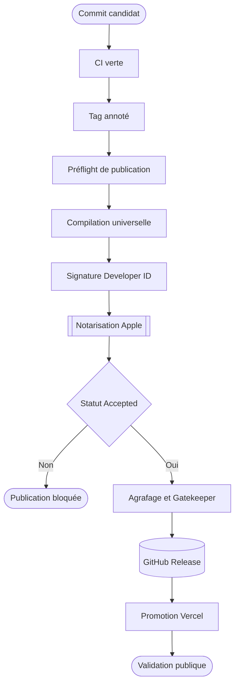

# Processus de publication

Une publication Huri part d’un commit validé sur `main`. Elle finit quand le DMG téléchargé depuis GitHub passe Gatekeeper et que la page Vercel pointe vers cet artefact. [Le workflow nommé Release][workflow-release] porte le chemin nominal.

## Flux de publication



## Préparer le candidat

Mets à jour `VERSION`, les notes FR et EN, puis les métadonnées concernées. Ne crée pas le tag avant une CI verte. [Le guide historique de publication][legacy-release] et [le workflow CI][workflow-ci] imposent les contrôles de base.

```bash
git diff --check
make verify
npx html-validate@latest index.html
node --check app.js
```

`make verify` régénère les localisations, exécute le lint, cherche des secrets, lance les tests, assemble l’application et vérifie le paquet. [Le Makefile][makefile] enchaîne ces cibles. Le résultat local reste signé ad hoc. Il prouve le paquet, pas la distribution publique.

## Créer le tag

Fusionne le candidat sur `main`. Attends la CI. Crée ensuite un tag annoté dont la version correspond exactement à `VERSION`.

```bash
release_version="$(tr -d '[:space:]' < VERSION)"
git tag -a "v${release_version}" -m "Huri ${release_version}"
git push production "v${release_version}"
```

[Le préflight][release-preflight] refuse un tag hors du format `vMAJOR.MINOR.PATCH`. Le workflow exige aussi un objet tag annoté et vérifie que le commit extrait correspond au commit du tag.

## Construire et signer

Le job de distribution importe le P12 dans un trousseau éphémère. Il écrit la clé App Store Connect dans le répertoire temporaire du runner. Les fichiers temporaires portent des permissions restrictives et sont supprimés à la fin du job.

`make downloads` appelle [le script de distribution][package-downloads]. Ce script exécute l’ordre suivant :

1. Compile `arm64` et `x86_64`
2. Assemble le binaire universel avec `lipo`
3. Signe l’application avec Developer ID et le Hardened Runtime
4. Vérifie la signature, les architectures et les ressources FR et EN
5. Crée puis signe le DMG
6. Soumet le DMG au service de notarisation Apple
7. Agrafe le ticket et lance l’évaluation Gatekeeper
8. Produit le dSYM et les sommes SHA-256

[Le script de paquetage][package-app] assemble l’application. [Le script DMG][create-dmg] crée l’image disque. Aucun de ces scripts ne décide seul qu’un artefact est publiable.

## Notariser

[Le script de notarisation][notarize] accepte deux sources d’accès : un profil de trousseau local ou une clé API App Store Connect. Le runner GitHub utilise la clé API temporaire.

`notarytool submit --wait` doit retourner `Accepted`. Tout autre statut arrête la publication. Le script récupère un résumé d’erreur sans imprimer le journal Apple privé dans la sortie publique.

Une acceptation ne suffit pas. `stapler staple`, `stapler validate` et `spctl` doivent réussir. Le ticket agrafé permet une validation hors connexion après téléchargement.

## Publier sur GitHub

Le workflow publie le contenu de `dist/releases/` :

- `Huri-macos-universal.dmg`
- la somme SHA-256 du DMG
- l’archive dSYM versionnée
- la somme SHA-256 de l’archive dSYM

Le nom du DMG reste stable. La page d’accueil utilise l’URL `latest` de GitHub Releases. Ne remplace jamais cet artefact sous un tag existant. Publie une version corrective.

La mise à jour Homebrew vient après la GitHub Release. Elle reste facultative. Le job la saute quand le jeton ou la variable du tap manque.

## Promouvoir Vercel

Le projet Vercel est lié au dépôt GitHub. Un push sur `main` peut déclencher un déploiement. [La configuration Vercel][vercel] ne sert que les fichiers statiques et ajoute les en-têtes HTTP du site.

Avant toute promotion, vérifie que le lien `latest` retourne le DMG publié. Valide ensuite l’aperçu. Une promotion manuelle reste possible :

```bash
npx vercel --prod --yes
```

Ne lance cette commande qu’après la validation de l’artefact public. Le site ne doit pas annoncer une version dont le DMG répond en erreur.

## Garder le Mac App Store optionnel

Le job App Store ne s’exécute jamais sur un simple push de tag. Il exige un lancement manuel avec `publish_app_store` activé. [Le script App Store][package-app-store] produit alors un paquet sandboxé signé et le workflow l’envoie à App Store Connect.

Cette branche ne bloque pas la distribution Developer ID. L’absence de profil App Store ne bloque ni GitHub Releases, ni Vercel.

## Revenir à une version saine

Un retour arrière, ou `rollback`, restaure un état connu. Il ne réécrit pas l’histoire.

| Canal | Action |
|---|---|
| Vercel | Promouvoir le dernier déploiement sain, puis corriger `main` par un nouveau commit |
| GitHub Releases | Désactiver la publication fautive et publier une version corrective ; ne pas remplacer l’artefact |
| Homebrew | Restaurer le dernier couple URL et SHA valide, puis pousser le cask corrigé |
| Apple | Révoquer le certificat ou la clé compromis, restaurer depuis Proton Pass, renouveler les secrets GitHub |
| App Store | Retirer la version concernée ; ne jamais réutiliser un numéro de build |

Consigne la version touchée, l’heure, le canal, la décision et les preuves de validation. [Le guide web][web-release] complète ce retour arrière.

[workflow-release]: https://github.com/Pacific-knowledge-LLC/Huri/blob/main/.github/workflows/release.yml
[workflow-ci]: https://github.com/Pacific-knowledge-LLC/Huri/blob/main/.github/workflows/ci.yml
[legacy-release]: https://github.com/Pacific-knowledge-LLC/Huri/blob/main/docs/RELEASE.md
[web-release]: https://github.com/Pacific-knowledge-LLC/Huri/blob/main/docs/WEB_RELEASE.md
[makefile]: https://github.com/Pacific-knowledge-LLC/Huri/blob/main/Makefile
[release-preflight]: https://github.com/Pacific-knowledge-LLC/Huri/blob/main/Scripts/release-preflight.sh
[package-downloads]: https://github.com/Pacific-knowledge-LLC/Huri/blob/main/Scripts/package-downloads.sh
[package-app]: https://github.com/Pacific-knowledge-LLC/Huri/blob/main/Scripts/package-app.sh
[create-dmg]: https://github.com/Pacific-knowledge-LLC/Huri/blob/main/Scripts/create-dmg.sh
[notarize]: https://github.com/Pacific-knowledge-LLC/Huri/blob/main/Scripts/notarize-dmg.sh
[package-app-store]: https://github.com/Pacific-knowledge-LLC/Huri/blob/main/Scripts/package-app-store.sh
[vercel]: https://github.com/Pacific-knowledge-LLC/Huri/blob/main/vercel.json
