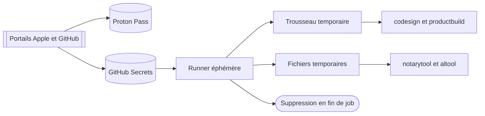

# Secrets de publication

Le dépôt ne contient aucune valeur d’accès. GitHub Secrets injecte le strict nécessaire dans le job concerné. Proton Pass conserve la copie de restauration chiffrée, hors du dépôt et hors des journaux.

## Chaîne de confiance



## Secrets Developer ID

Ces six secrets suffisent à publier le DMG du site. [Le job de distribution][workflow-release] refuse de démarrer si l’un manque.

| Nom GitHub | Source | Consommateur |
|---|---|---|
| `APPLE_CERTIFICATE_P12` | Export chiffré du certificat Developer ID et de sa clé privée depuis le trousseau macOS | Import du trousseau éphémère |
| `APPLE_CERTIFICATE_PASSWORD` | Mot de passe créé lors de l’export P12 | Commande `security import` |
| `DEVELOPER_ID_APPLICATION` | Libellé de l’identité Developer ID Application installée | `codesign` pour l’application et le DMG |
| `ASC_KEY_ID` | Métadonnée de la clé d’équipe dans App Store Connect | `notarytool` |
| `ASC_ISSUER_ID` | Métadonnée de l’émetteur dans App Store Connect | `notarytool` |
| `ASC_PRIVATE_KEY` | Fichier privé téléchargé une seule fois lors de la création de la clé App Store Connect | Fichier temporaire utilisé par `notarytool` |

Ne copie aucune valeur dans une issue, une PR, un commentaire, une documentation ou une commande enregistrée dans l’historique du shell.

## Secrets App Store optionnels

Ces secrets ne servent que lorsque `publish_app_store` est activé manuellement. Ils ne conditionnent pas la publication Developer ID.

| Nom GitHub | Source | Consommateur |
|---|---|---|
| `APP_STORE_APPLICATION_IDENTITY` | Libellé du certificat de signature d’application Mac App Store | `codesign` via le script App Store |
| `APP_STORE_INSTALLER_IDENTITY` | Libellé du certificat de signature d’installateur Mac App Store | `productbuild` |
| `APP_STORE_PROVISIONING_PROFILE` | Profil de provisioning Mac App Store téléchargé depuis Apple Developer | Paquet sandboxé Huri |

Le même P12 peut contenir plusieurs identités. Vérifie son inventaire avant rotation. Ne documente jamais les libellés réels.

## Accès Homebrew et GitHub

| Nom | Type | Source | Consommateur |
|---|---|---|---|
| `HOMEBREW_TAP_TOKEN` | Secret facultatif | Jeton GitHub à portée minimale, limité au dépôt du tap | Clone et push du cask |
| `HOMEBREW_TAP_REPOSITORY` | Variable de dépôt | Chemin du dépôt de tap détenu par l’équipe | Sélection du dépôt cible |
| `GITHUB_TOKEN` | Jeton éphémère fourni par GitHub Actions | GitHub | Création de la GitHub Release |

Le workflow limite `GITHUB_TOKEN` à `contents: write` dans le job de publication. Le job CI garde `contents: read`. N’ajoute pas de permission globale pour contourner un refus.

## Accès Vercel

Le code ne référence aucun secret Vercel. Le projet utilise l’intégration GitHub pour déployer `main`. Une session locale de CLI peut servir à une promotion manuelle, mais son accès ne doit pas entrer dans GitHub Secrets sans modification explicite du workflow.

Traite l’accès à l’équipe Vercel comme un accès persistant. Conserve la procédure de récupération dans Proton Pass. Ne conserve ni cookie, ni jeton de session dans le dépôt.

## Coffre de restauration Proton Pass

Proton Pass est le coffre de restauration. Il ne remplace ni Apple Developer, ni App Store Connect, ni GitHub Secrets. Il permet de reconstruire ces entrées après perte d’un poste ou rotation d’un runner.

Crée un élément distinct par moyen d’accès. Attache le P12, la clé privée App Store Connect et le profil de provisioning à leurs éléments respectifs. Stocke le mot de passe P12 séparément de l’archive. Ajoute la source, le propriétaire, la date de création, la date d’expiration et la procédure de révocation.

Ne colle jamais une valeur du coffre dans cette documentation. Ne l’exporte pas vers un fichier de travail. Transfère-la uniquement vers le champ GitHub Secret ou le trousseau cible, puis supprime toute copie temporaire.

## Injection dans le runner

[Le workflow nommé Release][workflow-release] applique quatre règles :

- `umask 077` avant d’écrire un fichier sensible
- écriture sous `RUNNER_TEMP`
- suppression des fichiers temporaires par `trap`
- suppression du trousseau temporaire dans une étape `always()`

Le P12 est décodé puis importé dans un trousseau créé pour le job. La clé privée App Store Connect est écrite dans un fichier temporaire. [Le script de notarisation][notarize] reçoit le chemin, l’identifiant de clé et l’émetteur sans imprimer leurs valeurs.

## Rotation

Une rotation remplace la source, le coffre et GitHub Secrets dans cet ordre :

1. Créer le nouveau certificat ou la nouvelle clé sur le portail source
2. Enregistrer la restauration dans Proton Pass
3. Mettre à jour les GitHub Secrets concernés
4. Vérifier l’identité disponible sans afficher sa matière privée
5. Produire une nouvelle version corrective
6. Révoquer l’ancien moyen d’accès après validation publique

Ne révoque pas l’ancien certificat avant d’avoir vérifié le nouveau chemin. En cas de compromission, inverse la priorité : révoque, bloque la publication, restaure, puis publie une version corrective.

## Détection des fuites

[`Scripts/check-secrets.sh`][check-secrets] inspecte le workspace et l’historique Git. Il signale seulement les chemins de fichiers. Il n’imprime pas la valeur détectée.

```bash
make security
```

Un résultat vert ne prouve pas l’absence de tout secret. Il couvre des motifs connus. La règle reste plus forte : aucune valeur dans Git.

[workflow-release]: https://github.com/Pacific-knowledge-LLC/Huri/blob/main/.github/workflows/release.yml
[notarize]: https://github.com/Pacific-knowledge-LLC/Huri/blob/main/Scripts/notarize-dmg.sh
[check-secrets]: https://github.com/Pacific-knowledge-LLC/Huri/blob/main/Scripts/check-secrets.sh
