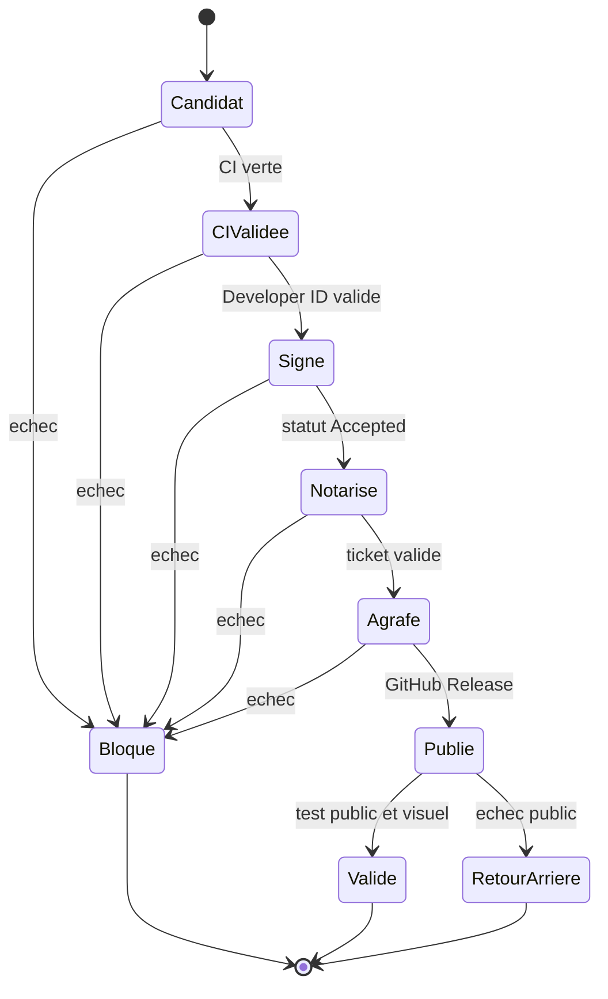

# Validation de publication

Une commande réussie ne suffit pas. La validation suit l’artefact du code source jusqu’au Mac d’un utilisateur. Chaque contrôle produit une preuve ou bloque la publication.

## États de validation



## Contrôle local

Lance ces contrôles avant la PR :

```bash
git diff --check
make verify
npx html-validate@latest index.html
node --check app.js
```

[Le Makefile][makefile] définit `make verify`. [Le workflow CI][workflow-ci] répète les contrôles sur un runner propre : dépendances verrouillées, localisations reproductibles, lint, scan de secrets, compilations Debug et Release, tests, paquetage et somme de contrôle.

Le DMG CI porte explicitement le nom `UNSIGNED-NOT-FOR-DISTRIBUTION`. Il reste signé ad hoc. Ne teste pas Gatekeeper sur cet artefact comme preuve de publication.

## Contrôle préalable

[`Scripts/release-preflight.sh`][release-preflight] vérifie :

- le format sémantique du tag
- l’égalité entre le tag et `VERSION`
- la validité du package Swift
- l’absence de motif d’accès sensible détecté

Le workflow ajoute deux contrôles : le tag doit être annoté et le commit extrait doit être celui du tag. Un tag léger bloque la publication.

## Contrôle de l’application

[`Scripts/verify-app.sh`][verify-app] contrôle le contenu de `Huri.app` :

- exécutable, `Info.plist` et icône
- ressources localisées FR et EN
- licence et notices tierces
- version et version minimale de macOS
- signature stricte
- architectures exigées
- identité Developer ID et Hardened Runtime pour la distribution

Le script lance ensuite [le test du paquet][smoke]. Ce test copie l’application hors de son contexte de compilation, masque `.build` et charge les ressources FR et EN. Il reproduit le cas d’un autre Mac. Un succès local depuis le dossier de compilation ne remplace pas ce test.

## Contrôle de notarisation

[`Scripts/notarize-dmg.sh`][notarize] soumet le DMG avec `notarytool --wait`. Le seul statut de succès est `Accepted`.

Le script enchaîne :

```bash
xcrun stapler staple "chemin/vers/Huri-macos-universal.dmg"
xcrun stapler validate "chemin/vers/Huri-macos-universal.dmg"
spctl --assess --type open --context context:primary-signature --verbose=2 \
  "chemin/vers/Huri-macos-universal.dmg"
```

Ne publie pas un DMG seulement accepté par Apple. Sans ticket agrafé et sans évaluation Gatekeeper, la preuve reste incomplète.

## Contrôle de distribution

[`Scripts/verify-distribution.sh`][verify-distribution] vérifie l’image disque, sa signature, son ticket et Gatekeeper. Il monte ensuite le DMG en lecture seule et relance la vérification complète sur l’application embarquée.

```bash
REQUIRED_ARCHS="arm64 x86_64" \
  bash Scripts/verify-distribution.sh dist/releases/Huri-macos-universal.dmg
```

Cette commande doit réussir après la notarisation et avant `gh release create`.

## Contrôle public GitHub

Télécharge le DMG et sa somme depuis la GitHub Release. Ne valide pas la copie restée dans `dist/`.

```bash
expected_sha="$(awk '{print $1}' Huri-macos-universal.dmg.sha256)"
actual_sha="$(shasum -a 256 Huri-macos-universal.dmg | awk '{print $1}')"
test "$actual_sha" = "$expected_sha"
```

Contrôle ensuite l’artefact téléchargé avec `verify-distribution.sh`. Télécharge aussi le DMG via un navigateur sur un Mac de test propre. Vérifie la présence de la quarantaine, ouvre le DMG, déplace Huri dans Applications et lance l’application sans contourner Gatekeeper.

Le test couvre deux machines : Apple Silicon et Intel, ou Apple Silicon plus Rosetta pour la seconde architecture. Le binaire doit déclarer les deux architectures.

## Contrôle Vercel

[Le guide web][web-release] fixe les contrôles de production :

1. Ouvrir la page d’accueil sur ordinateur et mobile
2. Tester la navigation, la démo et la recherche de formats
3. Vérifier les quatre CTA de téléchargement
4. Confirmer que chaque CTA atteint le DMG universel avec une réponse HTTP valide
5. Vérifier les en-têtes déclarés dans [`vercel.json`][vercel]
6. Exécuter Lighthouse avec performance au moins égale à 95, accessibilité à 100 et SEO à 100

Les boutons Apple Silicon et Intel peuvent partager le même lien. Le texte doit dire qu’il s’agit d’un DMG universel. Un aperçu protégé par authentification ne prouve pas l’accès public de la production.

## Preuves à conserver

Une publication terminée conserve :

- l’URL du run GitHub Actions
- le commit et le tag annoté
- le statut `Accepted` sans journal Apple privé
- les sommes SHA-256 publiées
- les sorties de `stapler`, `spctl` et du contrôle d’architectures
- le résultat du lancement sur Mac propre
- le résultat Lighthouse et les captures desktop et mobile
- l’URL du déploiement Vercel promu

Ne conserve aucune valeur de secret. Proton Pass porte la restauration des accès, pas les preuves de compilation.

## Décider le retour arrière

Déclenche le retour arrière si un seul de ces faits apparaît :

- le lien public répond en erreur
- la somme ne correspond pas
- Gatekeeper refuse le DMG ou l’application
- l’application plante sur un Mac sans contexte de compilation
- une architecture manque
- le site annonce une version différente de l’artefact
- un accès de signature est compromis

Restaure d’abord le dernier déploiement Vercel sain. Désactive ensuite la publication fautive. Corrige par un commit et une version corrective. Ne remplace pas l’artefact sous le même tag.

[makefile]: https://github.com/Pacific-knowledge-LLC/Huri/blob/main/Makefile
[workflow-ci]: https://github.com/Pacific-knowledge-LLC/Huri/blob/main/.github/workflows/ci.yml
[release-preflight]: https://github.com/Pacific-knowledge-LLC/Huri/blob/main/Scripts/release-preflight.sh
[verify-app]: https://github.com/Pacific-knowledge-LLC/Huri/blob/main/Scripts/verify-app.sh
[smoke]: https://github.com/Pacific-knowledge-LLC/Huri/blob/main/Scripts/smoke-packaged-app.sh
[notarize]: https://github.com/Pacific-knowledge-LLC/Huri/blob/main/Scripts/notarize-dmg.sh
[verify-distribution]: https://github.com/Pacific-knowledge-LLC/Huri/blob/main/Scripts/verify-distribution.sh
[web-release]: https://github.com/Pacific-knowledge-LLC/Huri/blob/main/docs/WEB_RELEASE.md
[vercel]: https://github.com/Pacific-knowledge-LLC/Huri/blob/main/vercel.json
